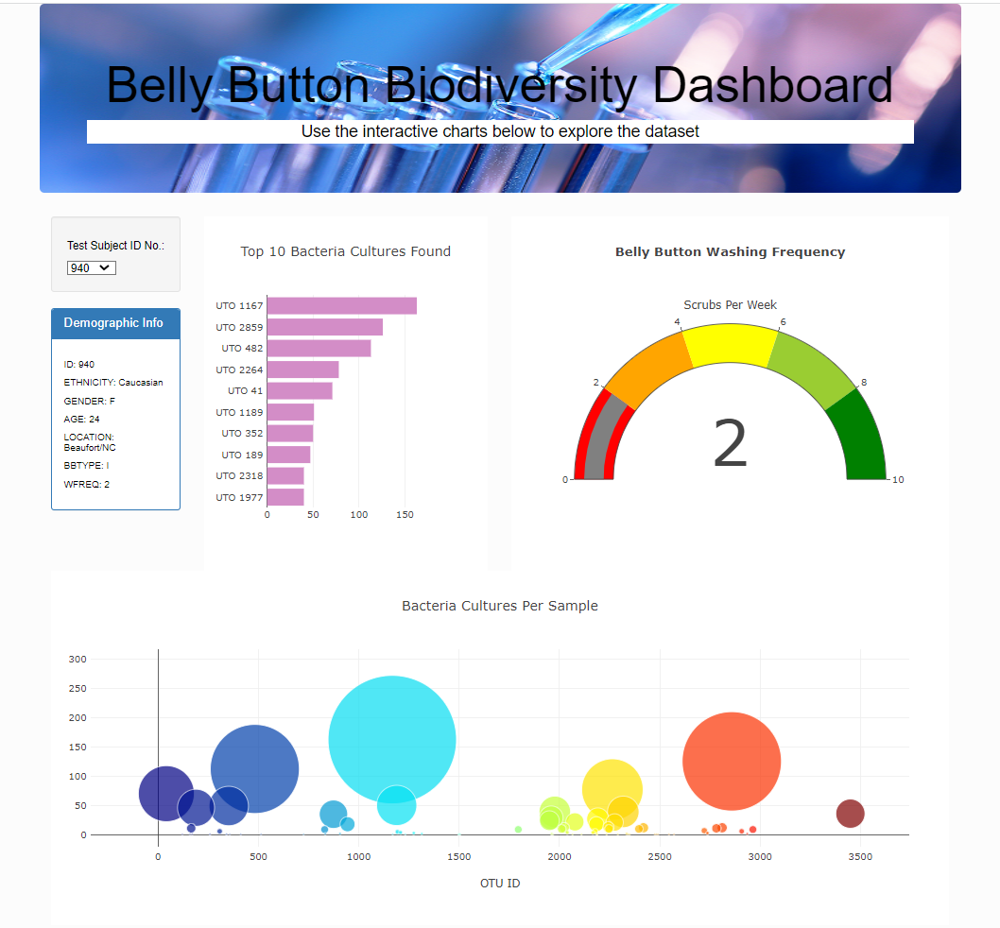

# Plotly

The pages loads with the bacterial data and charts of the participant # 940.
But we can change the participant and look at the information and charts belonging to another participant.

- Bar Chart showing the types of bacteria cultures and the amount of bacteria found in the belly button of any given participant.

- Gauge Chart shows the frequency of washing the belly button by participant per week.

- Bubble Chart created shows the bacteria culture code (and name) and the number found for each bacteria for any given participant

Bootstrap and CSS are used for changing the appearanch of the index page: 
- photo added to jumbotron
- colors of bar chart changed
- very light background added to the page
- layout slightly changed (out of the 12 columns, I changed the 2,5,5 grid layour to 2,4,6 grid layout)
- jumbotron subtitle color changed

